<div align="center">


# Disha — দিশা

**An offline, [Gemma 4](https://ai.google.dev/gemma)–powered AI disaster-response companion for Bangladesh.**
Built for the *Build with Gemma 4* Community Hackathon (Kaggle).

</div>

*Disha (দিশা) means "direction / guidance".* When floods and cyclones knock out mobile networks
in Bangladesh — exactly when coordination matters most — Disha keeps working: **Gemma 4 runs
entirely on-device**, so the app guides, triages, routes, and coordinates with **no internet**.

> Gemma 4 is the **reasoning core**, not a chatbot bolted on. It reasons over text, images, and
> location and **calls tools** to coordinate disaster response — all offline, on the phone.

Verified end-to-end on real Android phones (**Pixel 10a**, **Samsung Galaxy S21 FE**), fully offline.

---

## The app — real screenshots, captured on-device (offline)

<table>
  <tr>
    <td align="center"><br/><b>Splash</b><br/>দিশা, offline-first</td>
    <td align="center">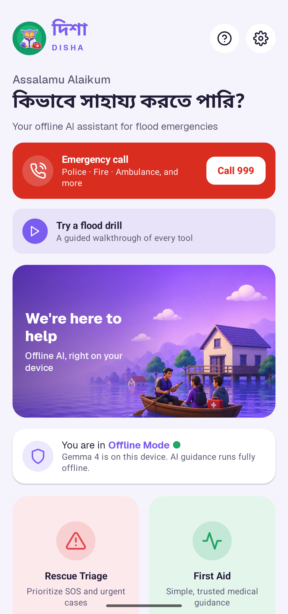<br/><b>Home (English)</b><br/>Emergency-first, offline status</td>
    <td align="center">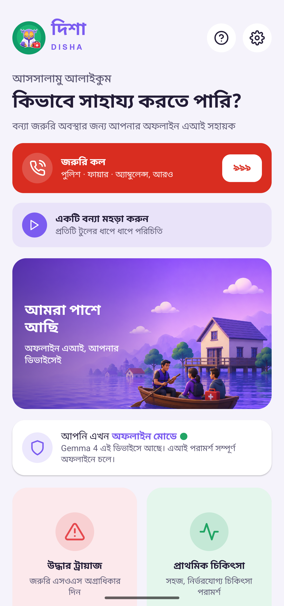<br/><b>Home (বাংলা)</b><br/>One toggle → whole UI in Bangla</td>
  </tr>
  <tr>
    <td align="center">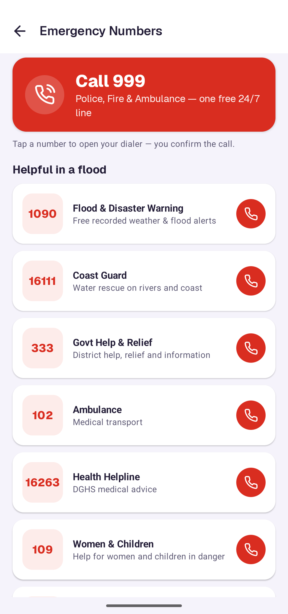<br/><b>Emergency Call</b><br/>Official BD hotlines, one tap</td>
    <td align="center">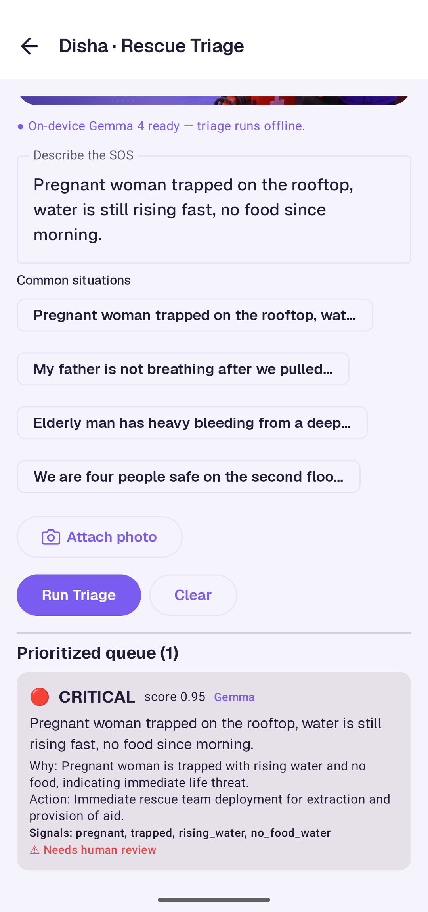<br/><b>Rescue Triage</b><br/>Gemma JSON → CRITICAL 0.95</td>
    <td align="center">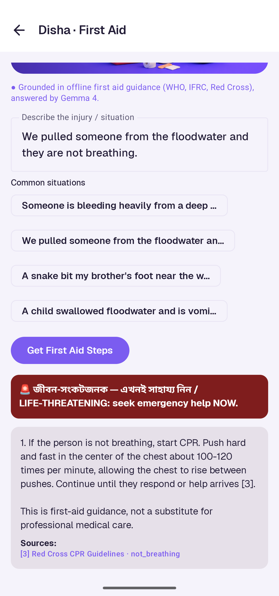<br/><b>First Aid</b><br/>Cited CPR (100–120/min)</td>
  </tr>
  <tr>
    <td align="center">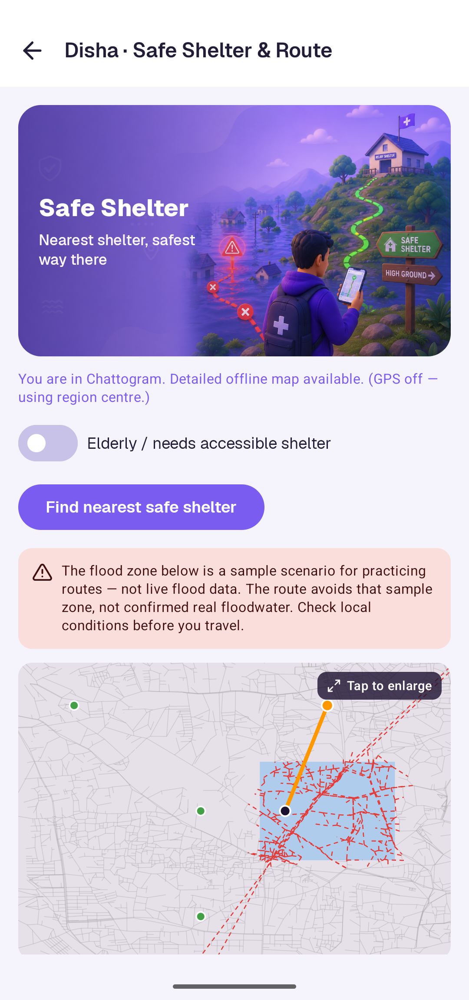<br/><b>Safe Shelter &amp; Route</b><br/>OSM route, flood-avoid</td>
    <td align="center">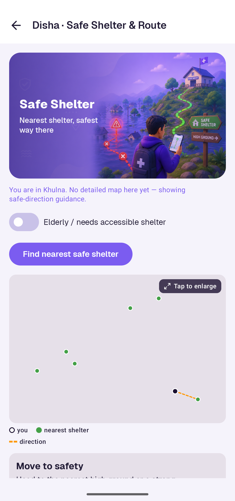<br/><b>Nationwide fallback</b><br/>Nearest of 9,525 shelters</td>
    <td align="center">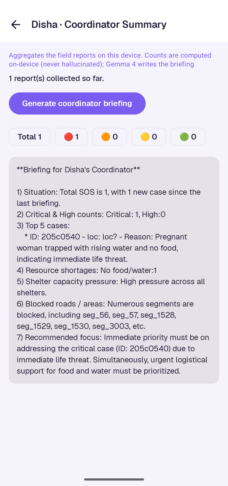<br/><b>Coordinator Summary</b><br/>Code counts, Gemma briefing</td>
  </tr>
  <tr>
    <td align="center">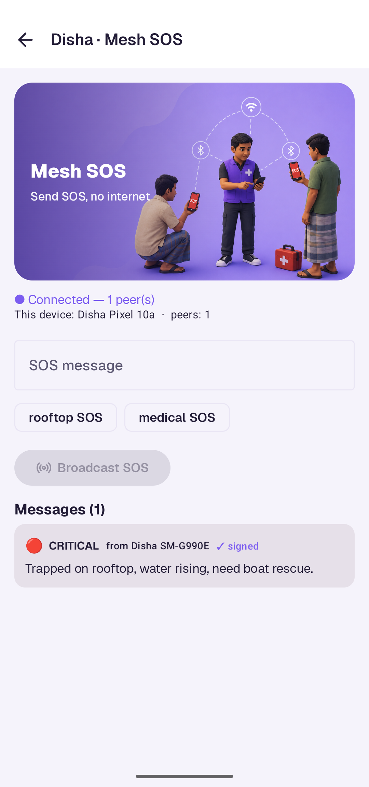<br/><b>Mesh SOS</b><br/>Ed25519 signed, phone-to-phone</td>
    <td align="center">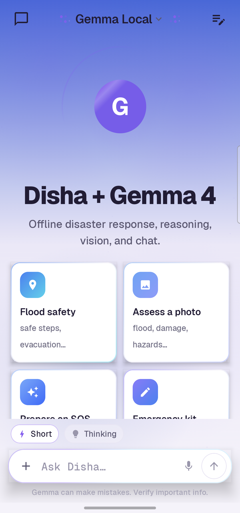<br/><b>AI Assistant</b><br/>On-device Gemma 4 chat</td>
    <td align="center">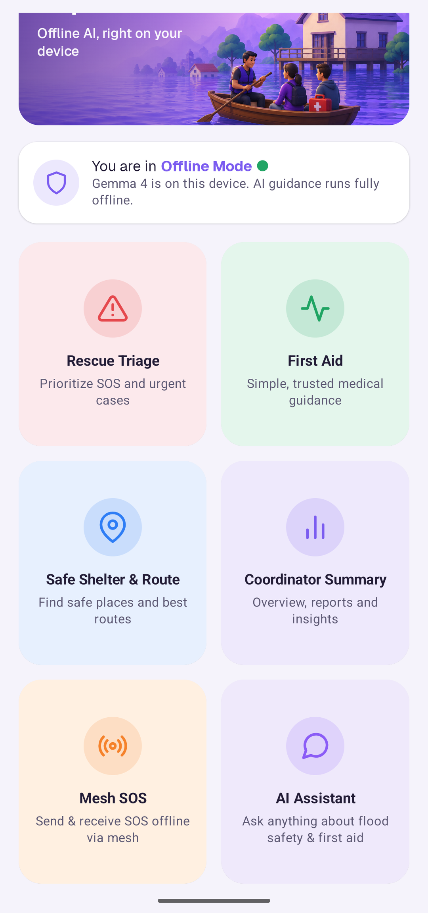<br/><b>All tools</b><br/>Every feature, one screen</td>
  </tr>
</table>

---

## What we built — feature → problem → technical decision

Every feature exists to solve a concrete failure of disaster response, and each pairs **Gemma's
reasoning** with a **deterministic tool** so the facts (priority, routes, counts, signatures) are
testable and never hallucinated.

| Feature | Problem it solves | How **Gemma 4** is used | Key technical decision |
| --- | --- | --- | --- |
| **Emergency Call** | Before *any* AI, people need the right official hotline **now** — and a call still needs signal. | — (works with no model) | One-tap **999** + curated official BD numbers (**1090** flood warning, **16111** Coast Guard, **333**, **102**, **16263**, **109**, **1098**) **bundled offline**; `ACTION_DIAL` needs no call permission and never dials without the user; links to Mesh SOS when there's no signal. |
| **Rescue Triage** | Responders are buried in SOS messages and can't tell which are life-threatening first. | Reads **text + photo (multimodal)** → emits **structured JSON** `{priority, signals, rationale}`. | Deterministic Triage engine ranks the queue and **forces human review** on critical cases; a **rule-based fallback** runs if the model is off; `generateWith()` isolates the task session from chat. |
| **First Aid** | People need trustworthy first aid **offline, in Bangla**, with no hallucinated medicine. | **Translates** a Bangla query to English once for retrieval, then writes a **grounded** answer and **refuses** when nothing fits. | **Hybrid RAG** (English tags = single source of truth, **k=4** so the CPR passage is always in scope); citations filtered to **only the sources actually used**; life-threat red-flag banner. |
| **Safe Shelter & Route** | Roads flood; people need a safe way to the nearest shelter — **anywhere** in the country. | Selects the **GIS tool** and narrates the guidance. | **Dijkstra flood-avoid** routing on **real OSM road graphs** (3 detailed districts); nationwide fallback finds the nearest of **9,525 real shelters** + safe-direction. Real GPS via `FusedLocation`; flood extent honestly labelled *illustrative*. |
| **Coordinator Summary** | Coordinators need an accurate briefing, **not invented numbers**. | Writes the prose **briefing**. | **All counts computed in code** from a shared `SosRepository` of **verified** reports; practice/drill data purged the moment a real report arrives; quarantined (unverified) reports excluded. |
| **Mesh SOS** | Floods knock out mobile networks exactly when coordination matters most. | — (pure transport/crypto, so it works even without the model) | **Ed25519-signed** SOS over **Nearby Connections** (BT/Wi-Fi), multi-hop relay, explicit **`isProductionTrusted()`** gate (`scheme == ed25519`) blocks a **downgrade attack**; forgeries **quarantined**. Verified phone-to-phone on two devices. |
| **AI Assistant** | General flood-safety & first-aid Q&A, offline. | On-device chat (**Short / Thinking** modes) + multimodal **photo assessment**. | Single-session **LiteRT-LM** managed via `generateWith()`; visible "Gemma can make mistakes" disclaimer. |
| **Full Bangla mode** | The people most affected read **Bangla**, not English. | Every answer switches language via a **single app-language directive**. | One toggle drives both UI (`LocalBangla`) and model output; a **completeness rule** keeps every number/dose verbatim (e.g. `100–120/min`). |
| **Flood drill + onboarding** | People shouldn't learn the tool *during* a real emergency. | Narrates each step. | Guided drill **seeds sample reports** (purged before real use), a first-run coach balloon, and a Guide screen. |

---

## Architecture

Gemma does the **reasoning and language**; math, routing, retrieval, crypto, and transport stay
**deterministic** so they're testable and never "hallucinate" a number — all on one phone, offline.

<p align="center">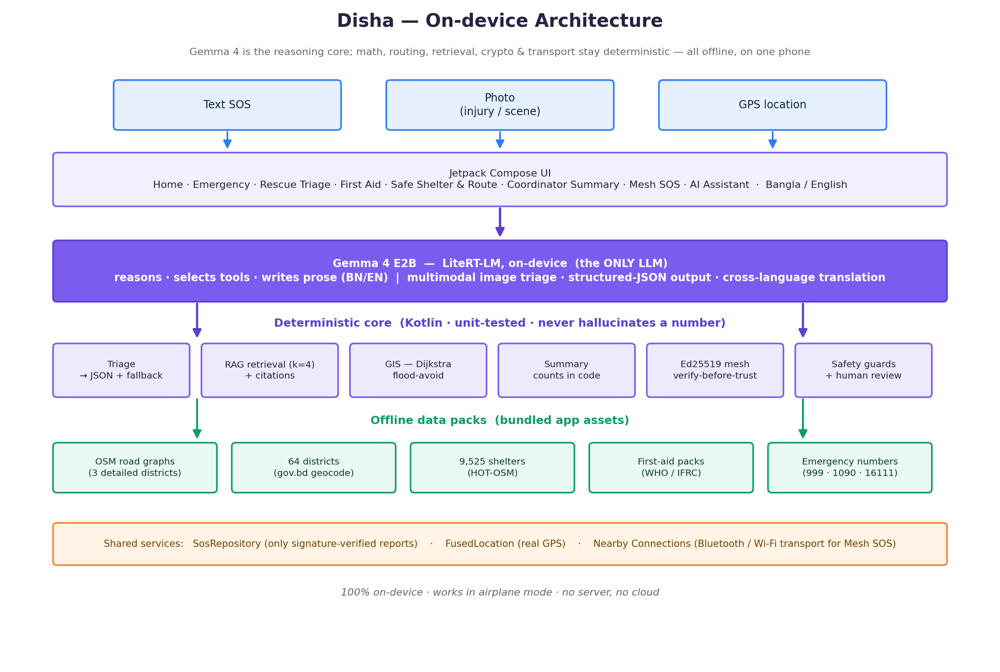</p>

> Editable source: [`docs/diagrams/architecture.drawio`](docs/diagrams/architecture.drawio) (open in [draw.io](https://app.diagrams.net)).

---

## How Gemma 4 drives every feature

Gemma reasons and writes; the deterministic core does the exact math, retrieval and crypto. If
Gemma is unavailable (not downloaded / low-RAM device), the core still runs.

<p align="center">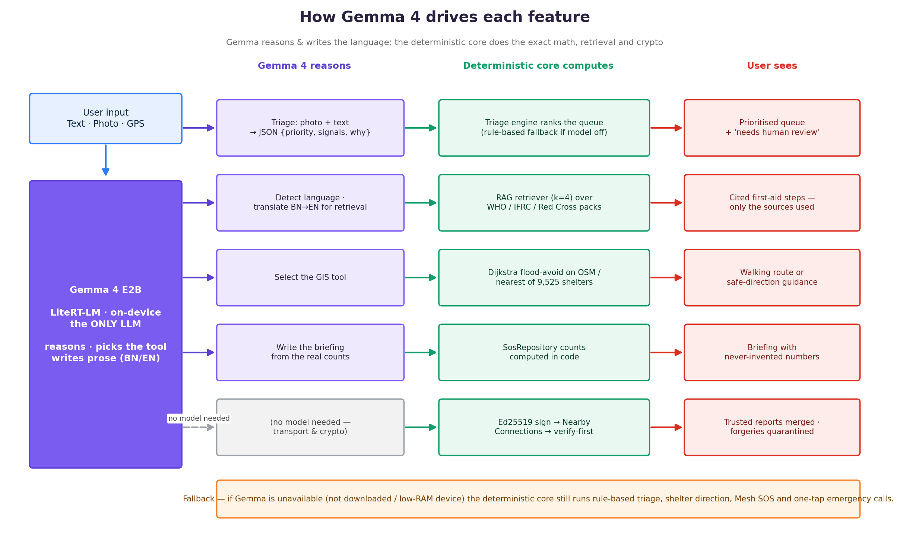</p>

> Editable source: [`docs/diagrams/gemma-flow.drawio`](docs/diagrams/gemma-flow.drawio).

---

## Technical hurdles & how we solved them

The hard part of "AI for disasters" is that the model has to run **on a phone, offline**, and be
**trustworthy** with real data. These are the problems we actually hit and how we fixed each.

### On-device Gemma
- **LiteRT-LM allows only ONE session at a time.** Calling a triage/first-aid task while the main
  chat session was open threw `FAILED_PRECONDITION`. → We wrote a `generateWith()` that **closes the
  main chat session, runs a temporary task session with its own system prompt, then restores the
  main session** — so every engine gets an isolated prompt without leaking chat state.
- **Toolchain mismatch.** System JDK 25 was too new for Gradle/AGP. → Build with **Android Studio's
  bundled JDK 21** (`JAVA_HOME=.../Android Studio/jbr`).
- **Model size vs. device RAM.** The `gemma-4-E2B-it.litertlm` model is ~2.5 GB and won't load on an
  emulator or low-RAM device. → Target real phones (~6 GB+ RAM); onboarding is scrollable with a
  "continue without the model" path so maps/mesh/emergency-calls still work if the model isn't downloaded.

### Offline mesh
- **Nearby Connections failed with `8034 MISSING_PERMISSION_ACCESS_COARSE_LOCATION`.** A
  `maxSdkVersion` cap on the location permission and missing runtime grants blocked discovery. →
  Removed the cap, requested COARSE/FINE + Bluetooth/Nearby-Wi-Fi at runtime, and ensured location
  services are on. Signed SOS then delivered phone-to-phone with multi-hop relay.
- **The signer was a SHA-256 hash, not a real signature — and a downgrade attack could bypass even
  that.** The mesh envelope's `Signer` was initially a `DevSigner` stand-in
  (`SHA256(nodeId | data)`) meant only for tests: it detects tampering but proves no identity, since
  anyone can compute the same hash for any claimed sender. Swapping in a real asymmetric
  **Ed25519** signer (BouncyCastle, persisted per-device keypair) closed that — but on review, a
  second issue surfaced: the receive path called the envelope's generic `verify()`, which honors
  whatever signing scheme the *sender* claims, so an attacker could still forge a "verified"
  envelope just by declaring the old `dev-sha256` scheme. → Added an explicit
  `isProductionTrusted()` gate that only accepts `scheme == "ed25519"`, with a unit test
  (`productionTrustRejectsSchemeDowngrade`) proving the downgrade path is rejected. Envelopes that
  fail this check are quarantined (`SosRepository.quarantine`), never merged into the trusted
  dataset the Coordinator Summary reads from. Verified end-to-end on two physical phones (Pixel
  10a ↔ Samsung Galaxy S21 FE) over real Nearby Connections — not just unit tests.

### Trustworthy First Aid (RAG)
- **Retrieval was too shallow.** With `k=2`, a "not breathing" query pulled the drowning + recovery
  passages but **cut off the passage with the actual CPR technique** — so Gemma safely refused
  instead of giving compressions. → Raised retrieval to **k=4** so the critical passage is always in
  scope.
- **Any-language retrieval without maintaining two tag sets.** The knowledge base is English; a
  Bangla query matched nothing. → A **hybrid retriever**: English tags stay the single source of
  truth, English queries match instantly, and a non-Latin query that misses is **translated to
  English once** (a dedicated, language-directive-free Gemma call) and retried. No dual maintenance,
  no latency on the common path, and it generalises to any language.
- **Bilingual answers were stunted.** A hardcoded "Bangla then English" instruction fought the app's
  language toggle, so one language came out complete and the other a stub. → Language is now driven
  by a single **app-language directive**, plus a **completeness rule** ("keep every number/rate/dose
  verbatim, e.g. 100–120/min").
- **Keyword hijacking & noisy citations.** "Burn from boiling water" scored high on *drowning*
  (because of "water"); noisy single-word matches polluted results. → We lean on the **two-layer
  design**: cast a wide net (k=4) and let **Gemma's grounding rules** pick the right passage and
  refuse when nothing fits (verified: it declines to give drowning advice for a burn, and still
  gives correct CPR for "collapsed and won't wake up"). We also **filter the Sources list to only
  the passages the answer actually cites** — so a CPR answer no longer looks like it came from a
  snakebite guideline.

### Real data, not demos
- **Coordinator Summary was reading bundled sample scenarios.** → Introduced a shared `SosRepository`
  fed by **real** Triage and Mesh reports; the briefing now reflects the actual situation on the
  device, with a proper empty state.
- **Hardcoded coordinates.** → Real GPS via `FusedLocationProvider`, with a graceful region-centre
  fallback when GPS is unavailable.
- **The app only worked in 3 hand-authored regions.** Floods hit far more of Bangladesh. → Bundled
  the open **64-district dataset** ([nuhil/bangladesh-geocode](https://github.com/nuhil/bangladesh-geocode),
  gov.bd-sourced, with Bangla names) to reverse-geocode any GPS fix to its district, so the app
  works **anywhere** and degrades gracefully where there's no detailed map.
- **No usable shelter dataset.** The government portal (GeoDASH) was **down at the DNS level**
  (SERVFAIL from multiple resolvers). → Used **HOT-OSM education facilities**
  (`hotosm_bgd_education_facilities`, ODbL): **9,525 schools/colleges across all 64 districts** — the
  buildings the government designates as flood/cyclone shelters — as the nationwide shelter layer.
- **Routing ran on a synthetic 12-node grid.** → Pulled the **real road network from OpenStreetMap**
  (Overpass) for the three detailed districts, simplified each to a routable junction graph
  (~5k/1.5k/0.5k nodes), verified connectivity, and route flood-avoidance now runs on actual
  streets. The flood **extent** is clearly labelled as an illustrative scenario (a live extent would
  need an FFWC/satellite feed).

### Reliability engineering
- **Python-first, then port.** The eight reasoning engines (triage, gis, rag, summary, safety, mesh,
  compress, gemma) were built and **unit-tested in Python**, then ported to Kotlin with JVM tests —
  so the disaster logic is deterministic and verifiable independent of the model.

---

## Repository layout

```
Disha/
├── prd/            Product + technical PRD (vision, features, architecture, build plan)
├── disha/          Python reasoning core (8 engines) + tests + Kaggle notebook
├── disha-android/  Android app (Kotlin + Jetpack Compose + LiteRT-LM)  ← the product
│   └── app/src/main/
│       ├── java/com/example/gemmachat/
│       │   ├── core/       reasoning engines (triage, gis, rag, summary, safety, mesh…)
│       │   ├── data/       AppPrefs · Regions · BdGeo · PublicShelters · SosRepository · RegionAssets
│       │   ├── inference/  EngineHolder (LiteRT-LM), GemmaLlmEngine
│       │   ├── location/   FusedLocation provider
│       │   └── ui/         home · emergency · triage · firstaid · gis · mesh · summary · chat · settings · demo · guide · splash
│       └── assets/         OSM road graphs · bd_districts.json · bd_shelters.json · first_aid_packs.json · region packs
├── docs/           README logo · app screenshots · draw.io diagrams
└── uiImages/       Design references and app art
```

---

## Run it

### Android app (on-device Gemma 4)
1. Open `disha-android/` in **Android Studio** (uses its bundled JDK 21).
2. Build & run on a **~6 GB+ RAM phone** (Android 12+). The app downloads
   **Gemma 4 E2B** (`litert-community/gemma-4-E2B-it-litert-lm`, ~2.5 GB) on first launch.
3. Everything after that runs **offline**. Try the **flood drill** on the home screen for a tour.

### Python core (no GPU / no model needed)
```bash
python -m disha.run_demo          # full pipeline via a deterministic mock
python -m disha.tests.test_core   # unit checks
```

---

## Gemma 4 integration
- **Model:** Gemma 4 E2B (`.litertlm`), on-device, offline — the **only** LLM used.
- **Runtime:** LiteRT-LM (`com.google.ai.edge.litertlm:litertlm-android`).
- **Uses:** multimodal (image) triage, structured-JSON output, grounded cited RAG, cross-language
  translation for retrieval, tool selection for GIS, and coordinator briefings. Math, routing,
  retrieval, crypto, and transport stay deterministic.

---

## Data & attribution
- **Roads & shelters:** © **OpenStreetMap** contributors (ODbL) — road networks via Overpass;
  shelters via HOT-OSM `hotosm_bgd_education_facilities`.
- **Districts:** [nuhil/bangladesh-geocode](https://github.com/nuhil/bangladesh-geocode) (gov.bd-sourced).
- **First-aid content:** grounded in WHO / IFRC / Red Cross guidance.
- **Emergency numbers:** official Government of Bangladesh short codes (999, 1090, 333, 16111, …).
- Flood extents in the detailed packs are **illustrative scenarios**, not live flood data.

## Credits & license
- The Android app started from the open-source **[amrrs/gemmachat-android](https://github.com/amrrs/gemmachat-android)**
  by [1littlecoder](https://x.com/1littlecoder) — a LiteRT-LM Gemma 4 chat starter. Thanks!
- Gemma is a Google DeepMind model; weights via the LiteRT Community on Hugging Face.
- Released under the MIT License (see `LICENSE`).
